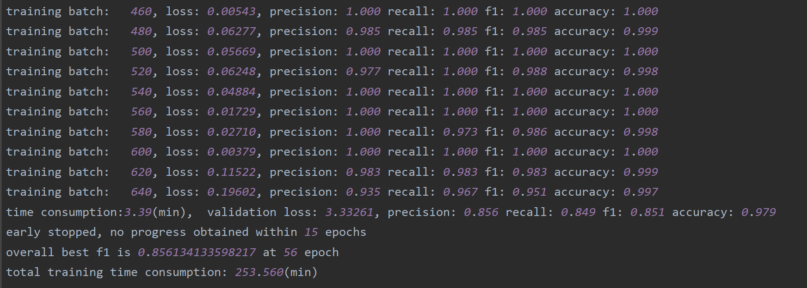

# 实体识别
此仓库是基于Tensorflow2.3的NER任务项目，既可以使用BiLSTM-Crf模型，也可以使用Bert-BiLSTM-Crf模型，提供可配置文档，配置完可直接运行。

## 环境
* python 3.6.7
* **CPU:** tensorflow==2.3.0
* **GPU:** tensorflow-gpu==2.3.0
* tensorflow-addons==0.11.2
* transformers==3.0.2

集群下推荐GPU加速训练，其他环境见requirements.txt

## 原理 
### Bilstm-CRF
 

### Bert-Bilstm-CRF
 
### CRF层
[最通俗易懂的BiLSTM-CRF模型中的CRF层介绍](https://zhuanlan.zhihu.com/p/44042528)  
[CRF Layer on the Top of BiLSTM - 1](https://createmomo.github.io/2017/09/12/CRF_Layer_on_the_Top_of_BiLSTM_1/)  
CRF层需要使用viterbi译码法，知乎上[这个答案](https://www.zhihu.com/question/20136144)比较容易理解    

## 更新历史
日期|版本|描述
:---|:---|---
2020-01-12|v1.0.0|初始仓库
2020-04-08|v1.1.0|重构项目代码，添加必要的注释
2020-04-13|v1.2.0|分别打印出每一个实体类别的指标
2020-09-09|v2.0.0|更新到tensorflow2.3版本
2020-09-10|v2.1.0|取消批量测试方法，简化预测的逻辑
2020-09-13|v3.0.0|增加Bert做embedding，通过配置支持BiLSTM-Crf和Bert-BiLSTM-Crf两种模型的训练与预测

## 使用
### 训练
将已经标注好的数据切割好训练、验证、测试集放入data目录下。  
在system.config的Datasets(Input/Output)下配置好数据集的路径、分隔符、模型保存地址等。  
在system.config的Labeling Scheme配置标注模式。  
在system.config的Model Configuration/Training Settings下配置模型参数和训练参数。  
设定system.config的Status中的为train。  
运行main.py开始训练。  
下图为日志记录训练完毕。 
 
  

### 效果对比

### 在线预测
外部模型需要配置好vocab_dir，checkpoints_dir，模型参数。本项目训练好的模型保持和训练时的参数不变即可。  
设定system.config的Status中的为interactive_predict。  
运行main.py开始在线预测。 
下图为在线预测结果。  

  

## 参考
+ NER相关的论文整理在[papers](papers)下
+ [https://github.com/scofield7419/sequence-labeling-BiLSTM-CRF](https://github.com/scofield7419/sequence-labeling-BiLSTM-CRF)
+ [维特比解码器](https://www.zhihu.com/question/20136144)
+ [最通俗易懂的BiLSTM-CRF模型中的CRF层介绍](https://zhuanlan.zhihu.com/p/44042528)
+ [CRF Layer on the Top of BiLSTM - 1](https://createmomo.github.io/2017/09/12/CRF_Layer_on_the_Top_of_BiLSTM_1/)