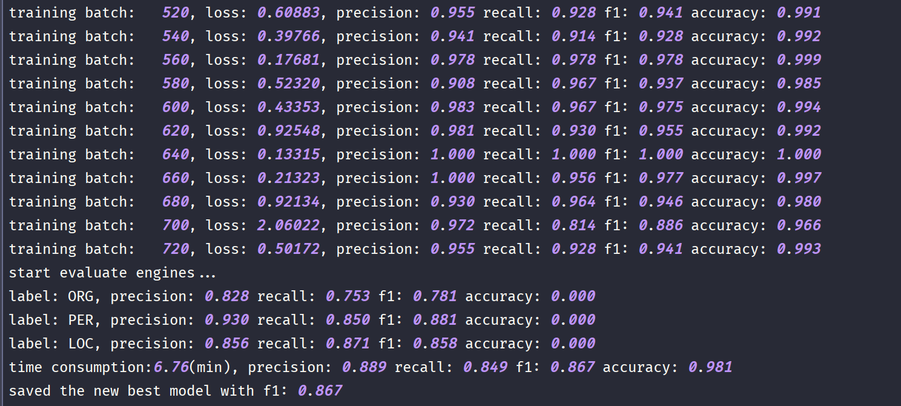
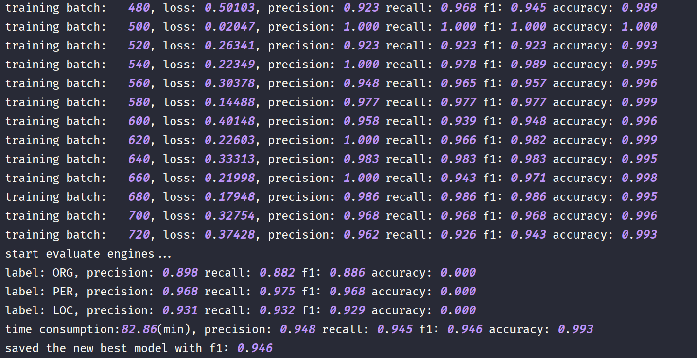

# 实体识别
此仓库是基于Tensorflow2.3的NER任务项目，既可以使用BiLSTM-Crf模型，也可以使用Bert-BiLSTM-Crf模型，提供可配置文档，配置完可直接运行。

## 更新历史
日期|版本|描述
:---|:---|---
2020-01-12|v1.0.0|初始仓库
2020-04-08|v1.1.0|重构项目代码，添加必要的注释
2020-04-13|v1.2.0|分别打印出每一个实体类别的指标
2020-09-09|v2.0.0|更新到tensorflow2.3版本
2020-09-10|v2.1.0|取消批量测试方法，简化预测的逻辑
2020-09-13|v3.0.0|增加Bert做embedding，通过配置支持BiLSTM-Crf和Bert-BiLSTM-Crf两种模型的训练与预测

## 环境
* python 3.6.7
* **CPU:** tensorflow==2.3.0
* **GPU:** tensorflow-gpu==2.3.0
* tensorflow-addons==0.11.2
* transformers==3.0.2

集群下推荐GPU加速训练，其他环境见requirements.txt

## 数据集
人民日报语料

## 原理 
### Bilstm-CRF

 

### Bert-Bilstm-CRF
 
### CRF层
[最通俗易懂的BiLSTM-CRF模型中的CRF层介绍](https://zhuanlan.zhihu.com/p/44042528)  
[CRF Layer on the Top of BiLSTM - 1](https://createmomo.github.io/2017/09/12/CRF_Layer_on_the_Top_of_BiLSTM_1/)  
CRF层需要使用viterbi译码法，知乎上[这个答案](https://www.zhihu.com/question/20136144)比较容易理解    

## 使用
### 训练
将已经标注好的数据切割好训练、验证集放入data目录下，如果只提供训练集将会有程序自己按照9:1切割训练集与验证集。  
在system.config的Datasets(Input/Output)下配置好数据集的路径、分隔符、模型保存地址等。  
在system.config的Labeling Scheme配置标注模式。  
在system.config的Model Configuration/Training Settings下配置模型参数和训练参数。  

设定system.config的Status中的为train:
```
################ Status ################
mode=train
# string: train/test/interactive_predict
```

是否使用Bert做embedding(选择True/False):
```
use_bert=False
```

运行main.py开始训练。  

* Bilstm-CRF模型下效果

  

* Bert-Blism-CRF模型下效果

  

***注(1):这里使用的[transformers](https://github.com/huggingface/transformers)包加载Bert，初次使用的时候会自动下载Bert的模型***  
***注(2):当重新训练的时候，Bert-Bilst-CRF和Bilstm-CRF各自自动生成自己vocabs/label2id文件，不能混用，如果需要共用，你可以手动的定义标签***   
***注(3):使用Bert-Bilst-CRF时候max_sequence_length不能超过512并且embedding_dim默认为768***

### 在线预测
仓库中已经训练好了两种模型在同一份数据集上的参数可直接进行试验，两者位于data/example_datasets目录下  
* 使用Bilstm-CRF模型时使用system.config4bilstm-crf的配置
* 使用Bert-Bilstm-CRF模型时使用system.config4bert-bilstm-crf的配置

将对应的配置命名为system.config然后替换掉当前的配置，设定system.config的Status中的为interactive_predict。  
运行main.py开始在线预测。   
下图为在线预测结果，你可以移植到自己项目里面做成对外接口。    

  

## 参考
+ NER相关的论文整理在[papers](papers)下
+ [https://github.com/scofield7419/sequence-labeling-BiLSTM-CRF](https://github.com/scofield7419/sequence-labeling-BiLSTM-CRF)
+ [维特比解码器](https://www.zhihu.com/question/20136144)
+ [最通俗易懂的BiLSTM-CRF模型中的CRF层介绍](https://zhuanlan.zhihu.com/p/44042528)
+ [CRF Layer on the Top of BiLSTM - 1](https://createmomo.github.io/2017/09/12/CRF_Layer_on_the_Top_of_BiLSTM_1/)