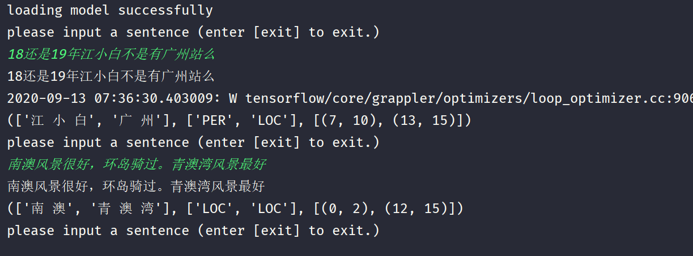

# 实体识别
此仓库是基于Tensorflow2.x的NER任务项目，使用BiLSTM+Crf模型，提供可配置文档，配置完可直接运行。
## 原理
将Embedding之后的向量输入到BiLSTM层中得到输出层的Softmax，将Softmax值放到条件随机场（CRF层）求解出最大可能的转移模式序列。  
这个项目中默认的Embedding使用词/字表结果放到BiLSTM层，也可以接入Word2vec/Bert之后的值放到BiLSTM层做Embedding，相关配置在system.config/use_pre_trained_embedding，注意和BiLSTM的输入维度对齐即可。  
需要使用Bert做Embedding需要可参考文章[papers/2018](papers)/BERT Pre-training of Deep Bidirectional Transformers for Language Understanding。  
BiLSTM层输出的Softmax可以直接做NER识别，因为BiLSTM模型输出的结果是词/字对应各类别的分数，我们可以选择分数最高的类别作为预测结果，但是会造成一些问题，所以加入CRF层，具体比较好的一篇文章请参考[最通俗易懂的BiLSTM-CRF模型中的CRF层介绍](https://zhuanlan.zhihu.com/p/44042528)和[CRF Layer on the Top of BiLSTM - 1](https://createmomo.github.io/2017/09/12/CRF_Layer_on_the_Top_of_BiLSTM_1/)。  
CRF层需要使用viterbi译码法，知乎上[这个答案](https://www.zhihu.com/question/20136144)比较容易理解。  
  

## 环境
* python 3.6.7
* tensorflow==2.3.0
* tensorflow-addons==0.11.2

其他环境见requirements.txt

## 更新历史
日期|版本|描述
:---|:---|---
2020-01-12|v1.0.0|初始仓库
2020-04-08|v1.1.0|重构项目代码，添加必要的注释
2020-04-13|v1.2.0|分别打印出每一个实体类别的指标
2020-09-09|v2.0.0|更新到tensorflow2.x版本

## 使用
### 训练
将已经标注好的数据切割好训练、验证、测试集放入data目录下。  
在system.config的Datasets(Input/Output)下配置好数据集的路径、分隔符、模型保存地址等。  
在system.config的Labeling Scheme配置标注模式。  
在system.config的Model Configuration/Training Settings下配置模型参数和训练参数。  
设定system.config的Status中的为train。  
运行main.py开始训练。  
下图为日志记录训练完毕。 
 
  

### 批量测试
外部模型需要配置好vocab_dir，checkpoints_dir，模型参数。本项目训练好的模型保持和训练时的参数不变即可。  
在system.config的Model Configuration/Training Settings下配置测试输出的参数。  
设定system.config的Status中的为test。  
运行main.py开始对测试数据集的数据进行批量预测。    
下图为测试数据集批量预测之后的结果。  

 

### 在线预测
外部模型需要配置好vocab_dir，checkpoints_dir，模型参数。本项目训练好的模型保持和训练时的参数不变即可。  
设定system.config的Status中的为interactive_predict。  
运行main.py开始在线预测。 
下图为在线预测结果。  

  

## 参考
+ NER相关的论文整理在[papers](papers)下。  
+ [https://github.com/scofield7419/sequence-labeling-BiLSTM-CRF](https://github.com/scofield7419/sequence-labeling-BiLSTM-CRF)
+ [https://github.com/zjy-ucas/ChineseNER](https://github.com/zjy-ucas/ChineseNER)
+ [https://github.com/macanv/BERT-BiLSTM-CRF-NER](https://github.com/macanv/BERT-BiLSTM-CRF-NER)
+ [维特比解码器](https://www.zhihu.com/question/20136144)
+ [最通俗易懂的BiLSTM-CRF模型中的CRF层介绍](https://zhuanlan.zhihu.com/p/44042528)
+ [最通俗易懂的BiLSTM-CRF模型中的CRF层介绍](https://zhuanlan.zhihu.com/p/44042528)和[CRF Layer on the Top of BiLSTM - 1](https://createmomo.github.io/2017/09/12/CRF_Layer_on_the_Top_of_BiLSTM_1/)